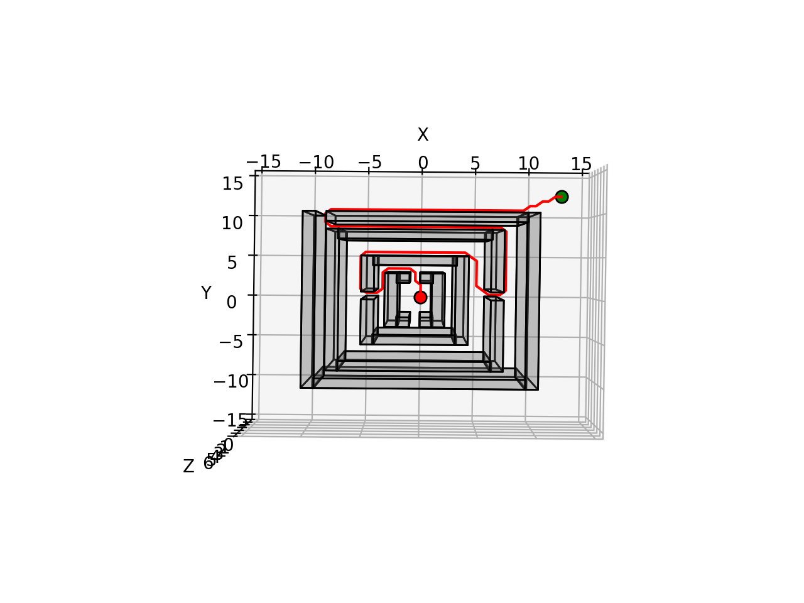
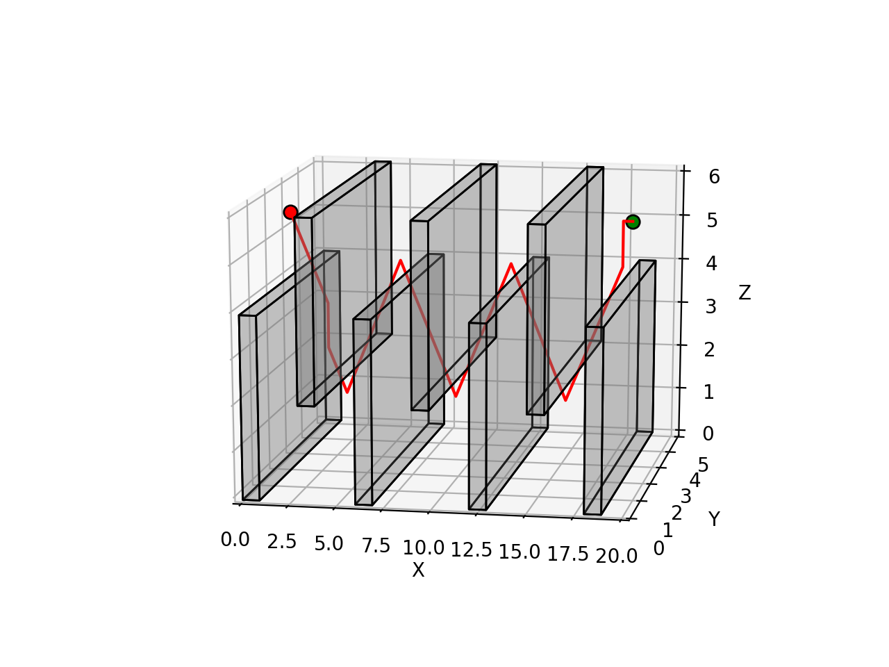
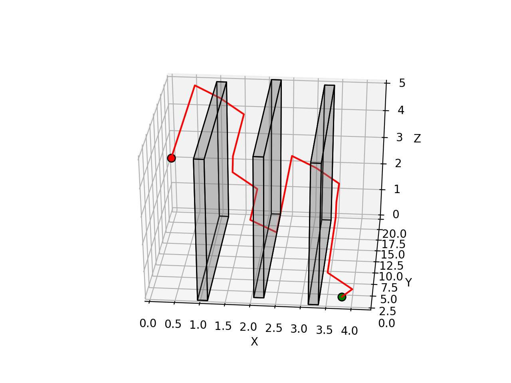
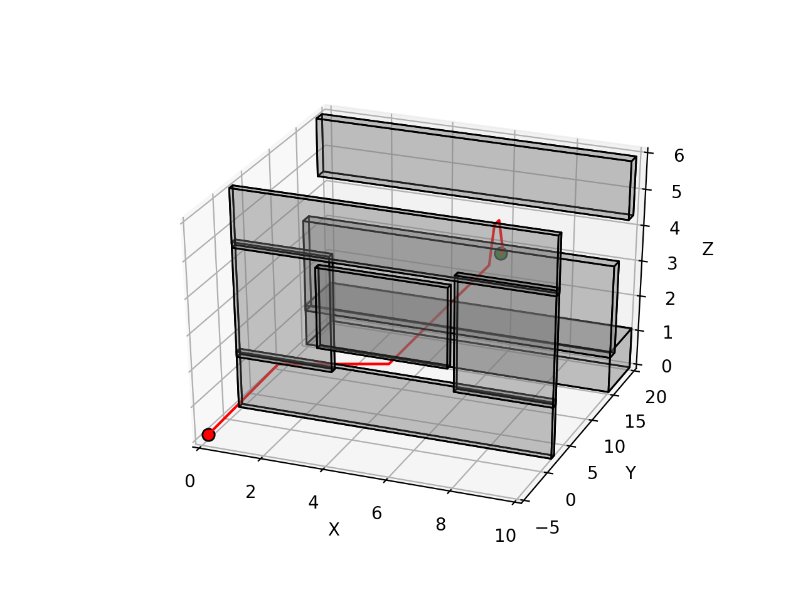
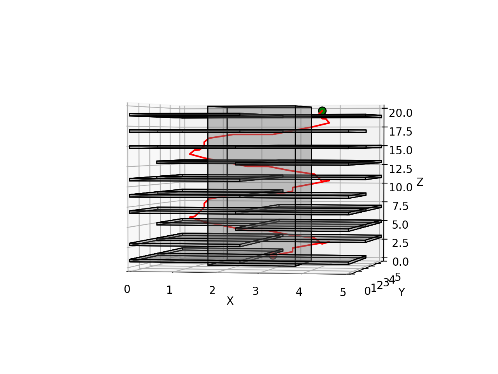
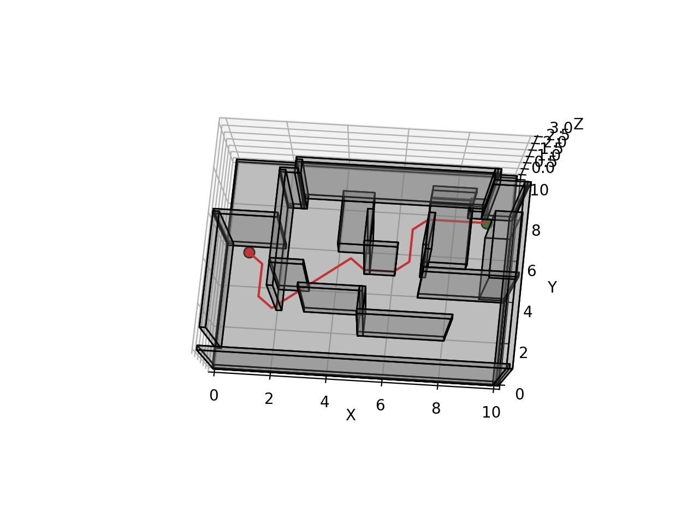

# A* Motion Planning
This repository contains code for A* path planning with continuos collision checking.
 | | 
--|--|--
 | | 

## A*
To run A* algorithm on various map, run this command:
```
python main_AStar.py
```

## Table of Content
### main_Astar.py
This file contains code to run A* algorithm on several different environments. 

### Planner.py
This file contains an implementation of A* path planner.

### utils.py
This file contains implementation for continuos collision checking between a ray and AABBs (axis aligned bounding box).

### maps/
This folder contains the 7 test environments described via a rectangular outer boundary and a list of rectangular obstacles. The start and goal points for each environment are specified in main_AStar.py.

## Reference
1. Ray AABB intersection: 
- https://www.scratchapixel.com/lessons/3d-basic-rendering/minimal-ray-tracer-rendering-simple-shapes/ray-box-intersection
- http://www.cs.cornell.edu/courses/cs4620/2013fa/lectures/03raytracing1.pdf
- https://tavianator.com/2015/ray_box_nan.html
- http://stack.gl/ray-aabb-intersection/